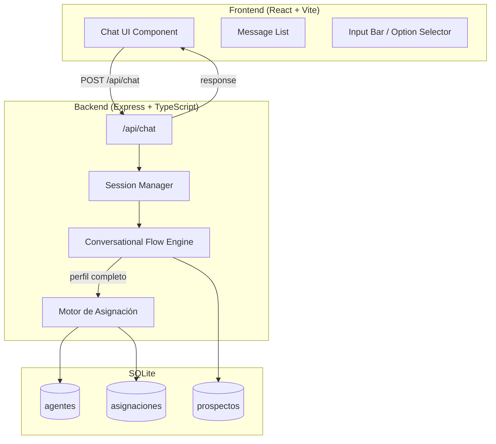
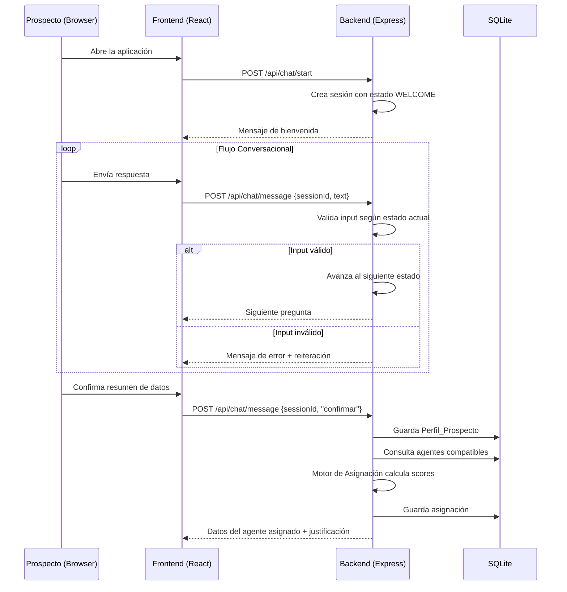
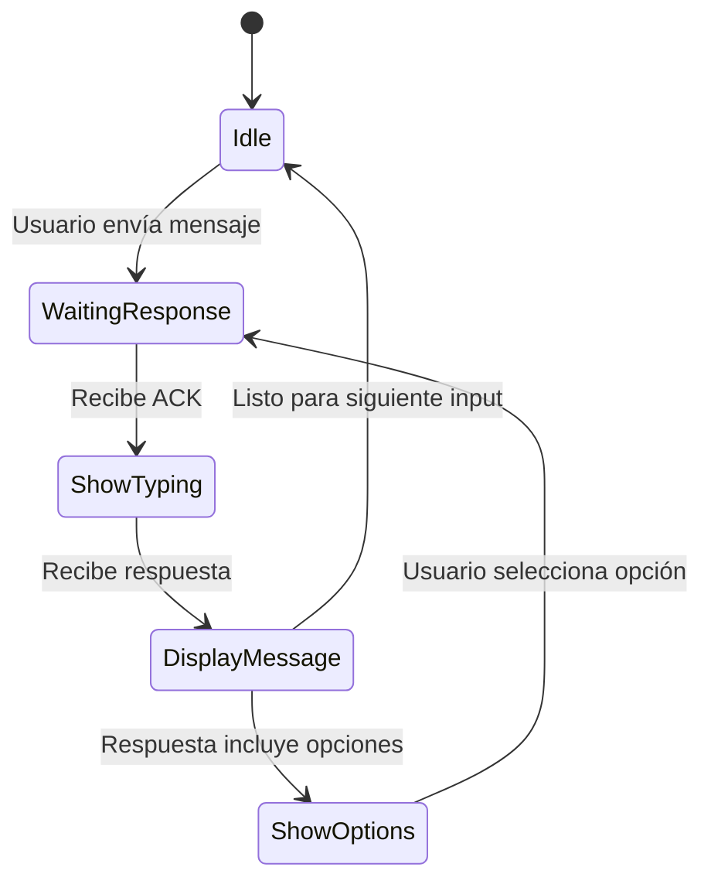
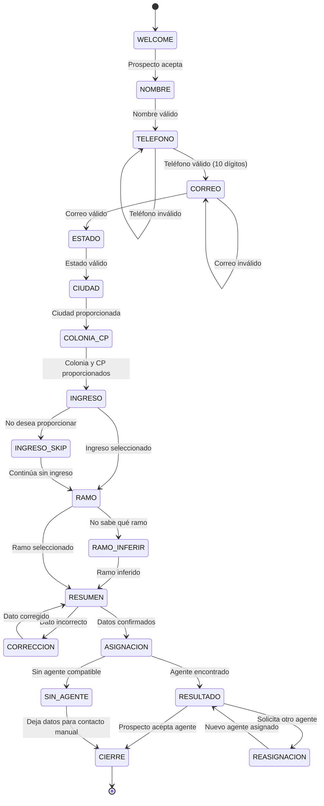

# Documento de Diseño — Chat de Asignación Inteligente de Agentes

## Resumen General

Este documento describe el diseño técnico de una aplicación web de chat conversacional que perfila prospectos de seguros y los asigna al agente más adecuado. La aplicación implementa los cuatro conceptos del Working Backwards de la Plataforma Integral de Asignación Inteligente (PIAI):

1. **Agente Espejo** — Afinidad socioeconómica entre prospecto y agente
2. **Radio de Confianza** — Proximidad geográfica (coincidencia de estado)
3. **Cartera Viva** — Balanceo de carga de trabajo del agente
4. **Especialista en Tu Momento** — Coincidencia de especialización técnica por ramo

El sistema consta de un chatbot web que guía al prospecto a través de un flujo conversacional para recopilar datos de contacto, domicilio, nivel socioeconómico y tipo de seguro. Con esos datos, un motor de asignación evalúa la compatibilidad con una base de datos de 50+ agentes y presenta al prospecto el agente más adecuado.

### Stack Tecnológico

- **Frontend**: React + TypeScript con Vite
- **Backend**: Node.js + Express + TypeScript
- **Base de Datos**: SQLite (vía better-sqlite3) para simplicidad y portabilidad
- **Seed Script**: TypeScript ejecutable con ts-node
- **Testing**: Vitest + fast-check (property-based testing)

### Decisiones de Diseño Clave

| Decisión | Justificación |
|---|---|
| SQLite en lugar de PostgreSQL | Proyecto de hackathon; simplicidad de setup sin servidor de BD externo |
| Flujo conversacional basado en estados | Predecible, testeable, fácil de mantener vs. NLP completo |
| Ponderación configurable en el motor | Permite ajustar la importancia relativa de cada criterio sin cambiar código |
| API REST simple | Suficiente para el flujo request-response del chat; no requiere WebSockets |
| Estado de conversación en sesión del servidor | Simplifica el manejo de estado; la sesión se preserva ante recargas |

---

## Arquitectura

### Diagrama de Arquitectura General



### Flujo de Datos Principal




---

## Componentes e Interfaces

### 1. Frontend — Chat UI

El frontend es una Single Page Application (SPA) en React que presenta una interfaz de chat conversacional.

#### Componentes React

| Componente | Responsabilidad |
|---|---|
| `App` | Layout principal, inicializa sesión |
| `ChatWindow` | Contenedor del área de mensajes y barra de entrada |
| `MessageList` | Renderiza la lista de mensajes con scroll automático |
| `MessageBubble` | Burbuja individual; alineación izquierda (sistema) o derecha (prospecto) |
| `InputBar` | Campo de texto + botón enviar para respuestas libres |
| `OptionSelector` | Botones/chips para selección de opciones (ramos, rangos de ingreso) |
| `TypingIndicator` | Indicador de "escribiendo..." antes de respuestas del sistema |
| `AgentCard` | Tarjeta con datos del agente asignado |
| `ProfileSummary` | Resumen de datos del prospecto para confirmación |

#### Flujo de Estado del Frontend



### 2. Backend — API REST

#### Endpoints

| Método | Ruta | Descripción | Request Body | Response |
|---|---|---|---|---|
| `POST` | `/api/chat/start` | Inicia nueva sesión de chat | `{}` | `{ sessionId, message, step }` |
| `POST` | `/api/chat/message` | Envía mensaje del prospecto | `{ sessionId, text }` | `{ message, step, options?, summary?, agent? }` |
| `GET` | `/api/chat/session/:id` | Recupera estado de sesión | — | `{ sessionId, step, profile }` |

#### Interfaz de Respuesta del Chat

```typescript
interface ChatResponse {
  sessionId: string;
  message: string;           // Texto del sistema
  step: ConversationStep;    // Estado actual del flujo
  options?: string[];         // Opciones seleccionables (ramos, ingresos)
  summary?: ProspectProfile;  // Resumen para confirmación
  agent?: AssignedAgent;      // Agente asignado (paso final)
  justification?: string;     // Explicación de la asignación
}
```

### 3. Conversational Flow Engine

El motor conversacional es una máquina de estados finita que gestiona el flujo de preguntas y validaciones.

#### Estados del Flujo



#### Interfaz del Flow Engine

```typescript
enum ConversationStep {
  WELCOME = 'WELCOME',
  NOMBRE = 'NOMBRE',
  TELEFONO = 'TELEFONO',
  CORREO = 'CORREO',
  ESTADO = 'ESTADO',
  CIUDAD = 'CIUDAD',
  COLONIA_CP = 'COLONIA_CP',
  INGRESO = 'INGRESO',
  RAMO = 'RAMO',
  RAMO_INFERIR = 'RAMO_INFERIR',
  RESUMEN = 'RESUMEN',
  CORRECCION = 'CORRECCION',
  ASIGNACION = 'ASIGNACION',
  RESULTADO = 'RESULTADO',
  SIN_AGENTE = 'SIN_AGENTE',
  REASIGNACION = 'REASIGNACION',
  CIERRE = 'CIERRE',
}

interface FlowTransition {
  validate: (input: string, profile: Partial<ProspectProfile>) => ValidationResult;
  nextStep: ConversationStep;
  extractData: (input: string) => Partial<ProspectProfile>;
  getMessage: (profile: Partial<ProspectProfile>) => string;
  options?: string[];
}
```

### 4. Motor de Asignación

El motor implementa los cuatro conceptos del Working Backwards con un sistema de scoring ponderado.

#### Algoritmo de Asignación

```typescript
interface AssignmentWeights {
  especialidad: number;  // Peso: 0.40 — Especialista en Tu Momento
  segmento: number;      // Peso: 0.35 — Agente Espejo
  geografia: number;     // Peso: 0.25 — Radio de Confianza
}

interface AgentScore {
  agente: Agent;
  scoreEspecialidad: number;  // 0 o 1 (match exacto de ramo)
  scoreSegmento: number;      // 0.0 a 1.0 (distancia NSE)
  scoreGeografia: number;     // 0 o 1 (match de estado)
  scorePrima: number;         // 0.0 a 1.0 (cercanía de prima al rango NSE)
  totalScore: number;         // Score ponderado final
}
```

#### Lógica de Scoring

1. **Especialidad (peso 0.40)**: Match binario — el `ramo_especialidad` del agente coincide con el tipo de seguro del prospecto. Score: 1.0 si coincide, 0.0 si no.

2. **Segmento Socioeconómico (peso 0.35)**: Distancia entre el NSE del prospecto y el `segmento_cartera` del agente. Score basado en proximidad en la escala NSE:
   - Match exacto: 1.0
   - 1 nivel de distancia: 0.7
   - 2 niveles: 0.4
   - 3+ niveles: 0.1

3. **Geografía (peso 0.25)**: Match binario — el `domicilio_estado` del agente coincide con el estado del prospecto. Score: 1.0 si coincide, 0.0 si no.

4. **Desempate por Prima**: Cuando múltiples agentes tienen el mismo score total, se selecciona al que tiene `prima_promedio_poliza` más cercana al rango esperado para el NSE del prospecto.

#### Relajación de Criterios

Si no hay agente con score > 0 en los tres criterios, se relajan en orden:
1. Primero se relaja geografía (se ignora el match de estado)
2. Luego se relaja segmento (se acepta cualquier segmento)
3. Siempre se mantiene la coincidencia de `ramo_especialidad`

```typescript
function assignAgent(profile: ProspectProfile, agents: Agent[]): AssignmentResult {
  const nse = classifyNSE(profile.ingresoMensual);
  
  // Fase 1: Filtrar por especialidad (siempre requerido)
  let candidates = agents.filter(a => a.ramo_especialidad === profile.ramoSeguro);
  
  // Fase 2: Calcular scores
  const scored = candidates.map(agent => calculateScore(agent, profile, nse));
  
  // Fase 3: Ordenar por score total, desempatar por prima
  scored.sort((a, b) => {
    if (b.totalScore !== a.totalScore) return b.totalScore - a.totalScore;
    return primaDistance(a, nse) - primaDistance(b, nse);
  });
  
  return scored[0] ?? null;
}
```

### 5. Seed Script

Script TypeScript que genera la base de datos inicial de agentes con datos correlacionados.

#### Lógica de Generación

```typescript
const NSE_PRIMA_RANGES: Record<string, [number, number]> = {
  'A/B': [3_000_000, 6_000_000],
  'C+':  [1_500_000, 3_000_000],
  'C':   [800_000, 1_500_000],
  'C−':  [400_000, 800_000],
  'D+':  [150_000, 400_000],
  'D':   [50_000, 150_000],
  'E':   [12_000, 50_000],
};

const RAMOS = ['VidaProtección', 'GMM', 'VidaAhorro'] as const;
const ESTADOS_MEXICO = ['Aguascalientes', 'Baja California', /* ... 32 estados */];
```

El script genera mínimo 50 agentes distribuyendo uniformemente entre segmentos y ramos, con:
- `id_agente`: 10 caracteres alfanuméricos aleatorios
- `nombre_completo`: Combinación de nombres y apellidos mexicanos comunes
- `telefono`: Formato `+52XXXXXXXXXX` (10 dígitos después del prefijo)
- `correo`: Derivado del nombre con dominio aleatorio
- `domicilio_estado`: Estado real de México
- `ramo_especialidad`: Uno de los tres ramos
- `segmento_cartera`: Nivel NSE aleatorio
- `prima_promedio_poliza`: Valor dentro del rango correspondiente al segmento


---

## Modelos de Datos

### Tabla: `agentes`

| Campo | Tipo | Restricciones | Descripción |
|---|---|---|---|
| `id_agente` | `TEXT` | PK, 10 chars alfanuméricos | Identificador único del agente |
| `nombre_completo` | `TEXT` | NOT NULL, max 150 chars | Nombre completo del agente |
| `telefono` | `TEXT` | NOT NULL, max 15 chars | Teléfono formato +52XXXXXXXXXX |
| `correo` | `TEXT` | NOT NULL | Correo electrónico |
| `domicilio_estado` | `TEXT` | NOT NULL | Estado de la República Mexicana |
| `ramo_especialidad` | `TEXT` | NOT NULL, CHECK IN ('VidaProtección','GMM','VidaAhorro') | Ramo de especialización |
| `segmento_cartera` | `TEXT` | NOT NULL, CHECK IN ('A/B','C+','C','C−','D+','D','E') | Segmento socioeconómico de cartera |
| `prima_promedio_poliza` | `REAL` | NOT NULL, CHECK >= 12000 AND <= 6000000 | Prima promedio en pesos |

### Tabla: `prospectos`

| Campo | Tipo | Restricciones | Descripción |
|---|---|---|---|
| `id` | `INTEGER` | PK, AUTOINCREMENT | ID interno |
| `nombre_completo` | `TEXT` | NOT NULL | Nombre del prospecto |
| `telefono` | `TEXT` | NOT NULL | Teléfono de 10 dígitos |
| `correo` | `TEXT` | NOT NULL | Correo electrónico |
| `estado` | `TEXT` | NOT NULL | Estado de residencia |
| `ciudad` | `TEXT` | NOT NULL | Ciudad o municipio |
| `colonia` | `TEXT` | NOT NULL | Colonia |
| `codigo_postal` | `TEXT` | NOT NULL | Código postal |
| `ingreso_mensual` | `TEXT` | NULL | Rango de ingreso seleccionado |
| `nse` | `TEXT` | NULL | NSE clasificado (A/B, C+, etc.) |
| `ramo_seguro` | `TEXT` | NOT NULL | Tipo de seguro seleccionado |
| `created_at` | `TEXT` | DEFAULT CURRENT_TIMESTAMP | Fecha de creación |

### Tabla: `asignaciones`

| Campo | Tipo | Restricciones | Descripción |
|---|---|---|---|
| `id` | `INTEGER` | PK, AUTOINCREMENT | ID interno |
| `prospecto_id` | `INTEGER` | FK → prospectos.id | Referencia al prospecto |
| `agente_id` | `TEXT` | FK → agentes.id_agente | Referencia al agente asignado |
| `score_total` | `REAL` | NOT NULL | Score de compatibilidad |
| `score_especialidad` | `REAL` | NOT NULL | Score de ramo |
| `score_segmento` | `REAL` | NOT NULL | Score socioeconómico |
| `score_geografia` | `REAL` | NOT NULL | Score geográfico |
| `justificacion` | `TEXT` | NOT NULL | Texto explicativo de la asignación |
| `created_at` | `TEXT` | DEFAULT CURRENT_TIMESTAMP | Fecha de asignación |

### Tabla NSE de Referencia (constante en código)

```typescript
interface NSERange {
  nivel: string;
  lectura: string;
  ingresoMin: number;
  ingresoMax: number;
  primaMin: number;
  primaMax: number;
}

const NSE_TABLE: NSERange[] = [
  { nivel: 'A/B', lectura: 'Alto',       ingresoMin: 78700, ingresoMax: Infinity, primaMin: 3000000, primaMax: 6000000 },
  { nivel: 'C+',  lectura: 'Medio alto', ingresoMin: 41200, ingresoMax: 78700,    primaMin: 1500000, primaMax: 3000000 },
  { nivel: 'C',   lectura: 'Medio',      ingresoMin: 31800, ingresoMax: 41200,    primaMin: 800000,  primaMax: 1500000 },
  { nivel: 'C−',  lectura: 'Medio bajo', ingresoMin: 21500, ingresoMax: 31800,    primaMin: 400000,  primaMax: 800000 },
  { nivel: 'D+',  lectura: 'Bajo alto',  ingresoMin: 15100, ingresoMax: 21500,    primaMin: 150000,  primaMax: 400000 },
  { nivel: 'D',   lectura: 'Bajo',       ingresoMin: 5600,  ingresoMax: 15100,    primaMin: 50000,   primaMax: 150000 },
  { nivel: 'E',   lectura: 'Muy bajo',   ingresoMin: 0,     ingresoMax: 5600,     primaMin: 12000,   primaMax: 50000 },
];
```

### Modelo de Sesión (en memoria)

```typescript
interface ChatSession {
  id: string;
  step: ConversationStep;
  profile: Partial<ProspectProfile>;
  createdAt: Date;
  lastActivity: Date;
}

interface ProspectProfile {
  nombreCompleto: string;
  telefono: string;
  correo: string;
  estado: string;
  ciudad: string;
  colonia: string;
  codigoPostal: string;
  ingresoMensual: string | null;  // Rango seleccionado o null si omitió
  nse: string | null;             // NSE clasificado
  ramoSeguro: string;             // VidaProtección | GMM | VidaAhorro
}
```

### Validaciones de Datos

```typescript
const VALIDATORS = {
  telefono: (input: string): boolean => /^\d{10}$/.test(input.replace(/\s/g, '')),
  correo: (input: string): boolean => /^[^\s@]+@[^\s@]+\.[^\s@]+$/.test(input),
  codigoPostal: (input: string): boolean => /^\d{5}$/.test(input.trim()),
};
```


---

## Propiedades de Correctitud

*Una propiedad es una característica o comportamiento que debe mantenerse verdadero en todas las ejecuciones válidas de un sistema — esencialmente, una declaración formal sobre lo que el sistema debe hacer. Las propiedades sirven como puente entre especificaciones legibles por humanos y garantías de correctitud verificables por máquina.*

### Propiedad 1: Validación de inputs rechaza formatos inválidos

*Para cualquier* cadena que no sea exactamente 10 dígitos numéricos, el validador de teléfono debe rechazarla. *Para cualquier* cadena que no cumpla el formato de correo electrónico (usuario@dominio.ext), el validador de correo debe rechazarla. En ambos casos, el flujo conversacional debe permanecer en el mismo paso y solicitar el dato nuevamente.

**Validates: Requirements 2.4, 2.5**

### Propiedad 2: Input válido actualiza el perfil correctamente

*Para cualquier* paso del flujo conversacional y cualquier input válido para ese paso, el campo correspondiente del `ProspectProfile` debe actualizarse con el valor proporcionado, y el flujo debe avanzar al siguiente paso.

**Validates: Requirements 3.4, 5.3**

### Propiedad 3: Clasificación NSE mapea ingreso al nivel correcto

*Para cualquier* valor de ingreso mensual, la función `classifyNSE` debe retornar el nivel socioeconómico correspondiente según la tabla de referencia: A/B para $78,700+, C+ para $41,200-$78,700, C para $31,800-$41,200, C− para $21,500-$31,800, D+ para $15,100-$21,500, D para $5,600-$15,100, E para $0-$5,600.

**Validates: Requirements 4.2**

### Propiedad 4: Scoring de asignación es correctamente ponderado

*Para cualquier* perfil de prospecto completo y cualquier conjunto de agentes, el score total de cada agente debe ser igual a: `(scoreEspecialidad × 0.40) + (scoreSegmento × 0.35) + (scoreGeografia × 0.25)`, y el agente seleccionado debe ser el que tiene el score total más alto.

**Validates: Requirements 6.1, 6.2**

### Propiedad 5: Desempate selecciona la prima más cercana al rango NSE

*Para cualquier* conjunto de agentes con score total idéntico, el agente seleccionado debe ser aquel cuya `prima_promedio_poliza` tiene la menor distancia absoluta al punto medio del rango de primas esperado para el NSE del prospecto.

**Validates: Requirements 6.3**

### Propiedad 6: Ramo de especialidad siempre coincide (invariante)

*Para cualquier* perfil de prospecto y cualquier base de datos de agentes que contenga al menos un agente con el ramo solicitado, el agente asignado debe tener `ramo_especialidad` igual al tipo de seguro del prospecto. Esta propiedad debe mantenerse incluso cuando se relajan los criterios de geografía y segmento.

**Validates: Requirements 6.4**

### Propiedad 7: Respuesta de asignación contiene todos los datos requeridos

*Para cualquier* asignación exitosa, la respuesta debe incluir: nombre completo del agente, teléfono, correo electrónico, ramo de especialidad, y un texto de justificación no vacío que mencione al menos uno de los criterios de afinidad (ubicación, perfil socioeconómico, especialización).

**Validates: Requirements 7.1, 7.2**

### Propiedad 8: Agentes generados tienen campos válidos

*Para cualquier* agente generado por el Seed Script: `id_agente` debe tener exactamente 10 caracteres alfanuméricos, `telefono` debe tener formato `+52` seguido de 10 dígitos, `domicilio_estado` debe ser uno de los 32 estados reales de la República Mexicana, `ramo_especialidad` debe ser uno de {VidaProtección, GMM, VidaAhorro}, y `segmento_cartera` debe ser uno de {A/B, C+, C, C−, D+, D, E}.

**Validates: Requirements 8.1, 8.4, 8.5**

### Propiedad 9: Prima de agente correlaciona con segmento de cartera

*Para cualquier* agente generado por el Seed Script, el valor de `prima_promedio_poliza` debe estar dentro del rango definido por la tabla NSE para su `segmento_cartera`. Por ejemplo, un agente con segmento A/B debe tener prima entre 3,000,000 y 6,000,000.

**Validates: Requirements 8.2**

### Propiedad 10: Resumen de perfil contiene todos los campos recopilados

*Para cualquier* perfil de prospecto completo, el resumen generado debe incluir: nombre, teléfono, correo, domicilio (estado, ciudad, colonia, código postal), rango de ingreso (si fue proporcionado) y tipo de seguro seleccionado.

**Validates: Requirements 9.1**

### Propiedad 11: Corrección de dato preserva los demás campos

*Para cualquier* perfil de prospecto completo y cualquier campo individual que se corrija, todos los demás campos del perfil deben permanecer sin cambios después de la corrección.

**Validates: Requirements 9.4**

### Propiedad 12: Input inválido mantiene el flujo en el mismo paso

*Para cualquier* paso del flujo conversacional y cualquier input que no sea válido para ese paso, el estado del flujo debe permanecer en el mismo paso (no avanzar ni retroceder).

**Validates: Requirements 10.1**

### Propiedad 13: Preservación de estado de sesión (round-trip)

*Para cualquier* sesión activa con un paso y perfil parcial determinados, recuperar la sesión por su ID debe retornar exactamente el mismo paso y los mismos datos de perfil. Es decir, `getSession(session.id).step === session.step` y `getSession(session.id).profile === session.profile`.

**Validates: Requirements 10.4**


---

## Manejo de Errores

### Errores de Validación de Input

| Escenario | Comportamiento | Mensaje al Prospecto |
|---|---|---|
| Teléfono con formato inválido | Permanece en paso TELEFONO | "El número de teléfono debe tener exactamente 10 dígitos. Por favor, inténtalo de nuevo." |
| Correo con formato inválido | Permanece en paso CORREO | "El formato del correo no parece correcto. ¿Podrías verificarlo?" |
| Input no relacionado con la pregunta | Permanece en paso actual | Reitera la pregunta con instrucciones más claras |

### Errores del Motor de Asignación

| Escenario | Comportamiento | Mensaje al Prospecto |
|---|---|---|
| Sin agentes con ramo coincidente | Transición a SIN_AGENTE | "No encontramos un agente especializado disponible en este momento. ¿Te gustaría dejar tus datos para que un coordinador te contacte?" |
| Sin agentes en la BD | Transición a SIN_AGENTE | Mismo mensaje anterior |
| Error de conexión a BD | Retorna error 503 | "Nuestro sistema está temporalmente fuera de servicio. Por favor, intenta de nuevo en unos minutos." |

### Errores de Sesión

| Escenario | Comportamiento | Respuesta HTTP |
|---|---|---|
| Session ID no encontrado | Retorna error | 404 — `{ error: "Sesión no encontrada. Inicia una nueva conversación." }` |
| Sesión expirada (>30 min inactividad) | Limpia sesión, retorna error | 410 — `{ error: "Tu sesión ha expirado. Inicia una nueva conversación." }` |
| Request sin sessionId | Retorna error | 400 — `{ error: "Se requiere un ID de sesión." }` |

### Estrategia de Resiliencia

- Las sesiones se almacenan en memoria con un TTL de 30 minutos de inactividad
- El endpoint `GET /api/chat/session/:id` permite al frontend recuperar el estado tras una recarga de página
- Los errores de BD se capturan con try/catch y retornan mensajes amigables al prospecto
- El frontend implementa retry automático (1 reintento) ante errores 503

---

## Estrategia de Testing

### Enfoque Dual: Unit Tests + Property-Based Tests

La estrategia de testing combina pruebas unitarias para ejemplos específicos y casos borde, con pruebas basadas en propiedades para verificar comportamientos universales.

### Librería de Property-Based Testing

- **fast-check** para TypeScript/JavaScript
- Configuración: mínimo 100 iteraciones por propiedad
- Cada test de propiedad debe referenciar su propiedad del documento de diseño

### Unit Tests (Vitest)

Los unit tests cubren ejemplos específicos, integraciones y edge cases:

| Área | Tests |
|---|---|
| Flow Engine | Flujo completo happy path; mensaje de bienvenida correcto; transiciones de estado específicas |
| Validadores | Teléfonos válidos específicos (5512345678); correos válidos específicos (user@example.com) |
| NSE Classification | Valores en los límites exactos ($78,700 → A/B, $78,699 → C+) |
| Motor de Asignación | Caso sin agentes compatibles; caso con un solo agente; error de BD |
| Seed Script | Genera exactamente 50+ agentes; cubre los 7 segmentos y 3 ramos |
| API Endpoints | Respuestas HTTP correctas; manejo de sesión expirada; request sin sessionId |

### Property-Based Tests (fast-check)

Cada propiedad del documento de diseño se implementa como un test de propiedad individual:

| Test | Propiedad | Tag |
|---|---|---|
| Validación rechaza inputs inválidos | Propiedad 1 | `Feature: chat-asignacion-agentes, Property 1: Input validation rejects invalid formats` |
| Input válido actualiza perfil | Propiedad 2 | `Feature: chat-asignacion-agentes, Property 2: Valid input updates profile` |
| Clasificación NSE correcta | Propiedad 3 | `Feature: chat-asignacion-agentes, Property 3: NSE classification maps income correctly` |
| Scoring ponderado correcto | Propiedad 4 | `Feature: chat-asignacion-agentes, Property 4: Assignment scoring is correctly weighted` |
| Desempate por prima | Propiedad 5 | `Feature: chat-asignacion-agentes, Property 5: Tiebreaker selects closest prima` |
| Ramo siempre coincide | Propiedad 6 | `Feature: chat-asignacion-agentes, Property 6: Ramo especialidad always matches` |
| Respuesta de asignación completa | Propiedad 7 | `Feature: chat-asignacion-agentes, Property 7: Assignment response contains all required data` |
| Agentes generados válidos | Propiedad 8 | `Feature: chat-asignacion-agentes, Property 8: Generated agents have valid fields` |
| Prima correlaciona con segmento | Propiedad 9 | `Feature: chat-asignacion-agentes, Property 9: Agent prima correlates with segmento` |
| Resumen contiene todos los campos | Propiedad 10 | `Feature: chat-asignacion-agentes, Property 10: Profile summary contains all fields` |
| Corrección preserva otros campos | Propiedad 11 | `Feature: chat-asignacion-agentes, Property 11: Correction preserves other fields` |
| Input inválido no avanza el flujo | Propiedad 12 | `Feature: chat-asignacion-agentes, Property 12: Invalid input keeps flow on same step` |
| Round-trip de sesión | Propiedad 13 | `Feature: chat-asignacion-agentes, Property 13: Session state round-trip preservation` |

### Generadores para Property Tests (fast-check)

```typescript
// Generador de perfiles de prospecto
const prospectProfileArb = fc.record({
  nombreCompleto: fc.string({ minLength: 1, maxLength: 150 }),
  telefono: fc.stringOf(fc.constantFrom('0','1','2','3','4','5','6','7','8','9'), { minLength: 10, maxLength: 10 }),
  correo: fc.emailAddress(),
  estado: fc.constantFrom(...ESTADOS_MEXICO),
  ciudad: fc.string({ minLength: 1 }),
  colonia: fc.string({ minLength: 1 }),
  codigoPostal: fc.stringOf(fc.constantFrom('0','1','2','3','4','5','6','7','8','9'), { minLength: 5, maxLength: 5 }),
  ingresoMensual: fc.oneof(fc.constant(null), fc.constantFrom('$0-$5,600', '$5,600-$15,100', ...)),
  nse: fc.constantFrom('A/B', 'C+', 'C', 'C−', 'D+', 'D', 'E', null),
  ramoSeguro: fc.constantFrom('VidaProtección', 'GMM', 'VidaAhorro'),
});

// Generador de agentes
const agentArb = fc.record({
  id_agente: fc.stringOf(fc.constantFrom(...'abcdefghijklmnopqrstuvwxyz0123456789'.split('')), { minLength: 10, maxLength: 10 }),
  nombre_completo: fc.string({ minLength: 1, maxLength: 150 }),
  telefono: fc.tuple(fc.constant('+52'), fc.stringOf(fc.constantFrom('0','1','2','3','4','5','6','7','8','9'), { minLength: 10, maxLength: 10 })).map(([p, n]) => p + n),
  correo: fc.emailAddress(),
  domicilio_estado: fc.constantFrom(...ESTADOS_MEXICO),
  ramo_especialidad: fc.constantFrom('VidaProtección', 'GMM', 'VidaAhorro'),
  segmento_cartera: fc.constantFrom('A/B', 'C+', 'C', 'C−', 'D+', 'D', 'E'),
}).chain(agent => {
  const [min, max] = NSE_PRIMA_RANGES[agent.segmento_cartera];
  return fc.double({ min, max, noNaN: true }).map(prima => ({ ...agent, prima_promedio_poliza: prima }));
});

// Generador de ingreso mensual
const ingresoArb = fc.double({ min: 0, max: 200000, noNaN: true });
```

### Configuración de Tests

- Cada property test ejecuta mínimo **100 iteraciones**
- Los tests se ejecutan con `vitest --run` (sin modo watch)
- Estructura de archivos:
  ```
  src/
    __tests__/
      validators.test.ts          # Unit tests de validadores
      validators.property.test.ts # Property tests de validadores
      nse.test.ts                 # Unit tests de clasificación NSE
      nse.property.test.ts        # Property tests de clasificación NSE
      assignment.test.ts          # Unit tests del motor de asignación
      assignment.property.test.ts # Property tests del motor de asignación
      flow.test.ts                # Unit tests del flujo conversacional
      flow.property.test.ts       # Property tests del flujo
      seed.test.ts                # Unit tests del seed script
      seed.property.test.ts       # Property tests del seed script
      session.test.ts             # Unit tests de sesión
      session.property.test.ts    # Property tests de sesión
  ```
