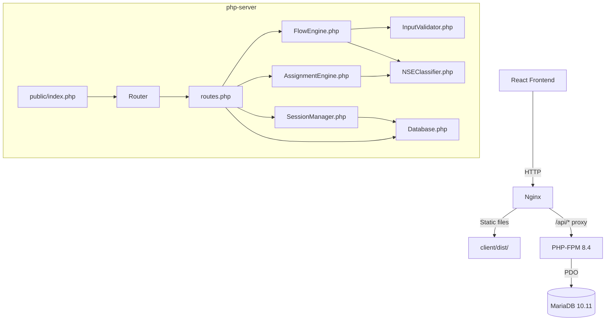

# Design Document: PHP/MariaDB Port

## Overview

This design describes the port of the existing Node.js/TypeScript/SQLite chat-based insurance agent assignment system to PHP 8.4/MariaDB 10.11/Nginx 1.22.1. The PHP backend lives in a `php-server/` directory at the workspace root and maintains full API compatibility with the existing React frontend (`client/dist/`).

The architecture shifts from an Express.js in-memory session model to a stateless PHP-FPM model with database-backed sessions. Nginx replaces the Node.js static file serving and acts as a reverse proxy to PHP-FPM. MariaDB replaces SQLite for persistent storage.

### Key Design Decisions

1. **No framework** — A lightweight custom router keeps the port close to the original Express structure and avoids framework overhead for 3 endpoints.
2. **Database-backed sessions** — PHP-FPM processes are stateless; all session state lives in the `sessions` table with JSON profile storage.
3. **PHP 8.4 enums** — `ConversationStep` and `RamoSeguro` become native PHP enums, providing type safety without external dependencies.
4. **PDO with prepared statements** — All database access uses PDO with named parameters to prevent SQL injection.
5. **Single entry point** — All API requests route through `public/index.php`, which bootstraps the application and delegates to the router.

## Architecture



### Request Lifecycle

1. Nginx receives request
2. If path matches a static file in `client/dist/` → serve directly
3. If path starts with `/api/` → proxy to PHP-FPM via FastCGI
4. `public/index.php` bootstraps: loads config, creates PDO connection, instantiates router
5. Router matches URI pattern and HTTP method → dispatches to handler
6. Handler uses SessionManager, FlowEngine, or AssignmentEngine as needed
7. JSON response returned with appropriate status code and CORS headers

## Components and Interfaces

### Directory Structure

```
php-server/
├── public/
│   └── index.php              # Single entry point (front controller)
├── src/
│   ├── Constants.php          # Enums, NSE table, weights, states list
│   ├── Database.php           # PDO singleton, schema init, query methods
│   ├── Router.php             # URI pattern matching and dispatch
│   ├── FlowEngine.php        # Conversation state machine
│   ├── AssignmentEngine.php   # Agent scoring and selection
│   ├── SessionManager.php     # Session CRUD with DB persistence
│   ├── NSEClassifier.php      # Income → NSE classification
│   ├── InputValidator.php     # Phone, email, postal code validation
│   └── helpers.php            # jsonResponse(), corsHeaders(), parseIncome()
├── config/
│   └── database.php           # DB connection parameters (env-based)
├── scripts/
│   └── seed.php               # Agent data seeding script
├── sql/
│   └── schema.sql             # MariaDB schema DDL
├── tests/
│   ├── AssignmentEngineTest.php
│   ├── FlowEngineTest.php
│   ├── InputValidatorTest.php
│   ├── NSEClassifierTest.php
│   ├── SessionManagerTest.php
│   └── SeedTest.php
├── nginx/
│   └── site.conf              # Nginx server block configuration
├── composer.json              # Dependencies (PHPUnit, php-fast-check)
└── phpunit.xml                # PHPUnit configuration
```

### Component Interfaces

#### Router (`src/Router.php`)

```php
final class Router
{
    public function addRoute(string $method, string $pattern, callable $handler): void;
    public function dispatch(string $method, string $uri): void;
}
```

- Pattern matching supports named parameters: `/api/chat/session/{id}`
- Unmatched routes return 404 JSON error
- Handles OPTIONS preflight with 204 + CORS headers

#### Database (`src/Database.php`)

```php
final class Database
{
    public static function getInstance(): self;
    public function getConnection(): PDO;
    public function initSchema(): void;
    public function getAgentsByRamo(string $ramo): array;
    public function insertProspecto(array $profile): int;
    public function insertAsignacion(int $prospectoId, string $agenteId, array $scores, string $justificacion): int;
    public function insertAgent(array $agent): void;
}
```

- Singleton pattern with lazy PDO initialization
- All queries use prepared statements with named parameters
- `initSchema()` runs the DDL from `sql/schema.sql` (used by seed script)

#### SessionManager (`src/SessionManager.php`)

```php
final class SessionManager
{
    private const TTL_SECONDS = 1800; // 30 minutes

    public function create(): array;
    public function get(string $id): ?array;
    public function isExpired(string $id): bool;
    public function update(string $id, array $updates): ?array;
    public function cleanExpired(): int;
}
```

- `create()` generates UUID v4, inserts row with step=WELCOME, empty JSON profile
- `get()` returns null if not found or expired; refreshes `last_activity` on read
- `isExpired()` checks if session exists but `last_activity` is older than 30 minutes
- `update()` merges profile JSON, updates step and `last_activity`
- Profile stored as JSON column in MariaDB

#### FlowEngine (`src/FlowEngine.php`)

```php
final class FlowEngine
{
    public function getWelcomeMessage(): string;
    public function processMessage(ConversationStep $step, string $input, array $profile): array;
    public function generateSummary(array $profile): string;
}
```

- Returns associative array: `['message' => string, 'step' => ConversationStep, 'profile' => array, 'options' => ?array]`
- Pure logic — no database access, no side effects
- Uses InputValidator and NSEClassifier internally

#### AssignmentEngine (`src/AssignmentEngine.php`)

```php
final class AssignmentEngine
{
    public function assignAgent(array $profile, array $agents): ?array;
    public function calculateScore(array $agent, array $profile, ?string $nse): array;
}
```

- Returns `['agent' => array, 'scores' => array, 'justification' => string]` or null
- Scoring weights: especialidad=0.40, segmento=0.35, geografía=0.25
- Tiebreaker: prima distance to NSE midpoint (ascending)

#### NSEClassifier (`src/NSEClassifier.php`)

```php
final class NSEClassifier
{
    public static function classify(int $income): string;
    public static function getPrimaRange(string $nse): array;
}
```

- `classify()` iterates from highest to lowest, returns first level where income ≥ ingresoMin
- `getPrimaRange()` returns `[primaMin, primaMax]` for a given NSE level

#### InputValidator (`src/InputValidator.php`)

```php
final class InputValidator
{
    public static function validateTelefono(string $input): bool;
    public static function validateCorreo(string $input): bool;
    public static function validateCodigoPostal(string $input): bool;
}
```

- Same regex patterns as the TypeScript validators
- Static methods, no state

#### Constants (`src/Constants.php`)

```php
enum ConversationStep: string
{
    case WELCOME = 'WELCOME';
    case NOMBRE = 'NOMBRE';
    case TELEFONO = 'TELEFONO';
    case CORREO = 'CORREO';
    case ESTADO = 'ESTADO';
    case CIUDAD = 'CIUDAD';
    case COLONIA_CP = 'COLONIA_CP';
    case INGRESO = 'INGRESO';
    case RAMO = 'RAMO';
    case RAMO_INFERIR = 'RAMO_INFERIR';
    case RESUMEN = 'RESUMEN';
    case CORRECCION = 'CORRECCION';
    case ASIGNACION = 'ASIGNACION';
    case RESULTADO = 'RESULTADO';
    case SIN_AGENTE = 'SIN_AGENTE';
    case REASIGNACION = 'REASIGNACION';
    case CIERRE = 'CIERRE';
}

enum RamoSeguro: string
{
    case VidaProteccion = 'VidaProtección';
    case GMM = 'GMM';
    case VidaAhorro = 'VidaAhorro';
}
```

- NSE_TABLE, NSE_PRIMA_RANGES, ESTADOS_MEXICO, DEFAULT_WEIGHTS as class constants or top-level arrays
- PHP 8.4 backed enums with string values for JSON serialization

### Nginx Configuration (`nginx/site.conf`)

```nginx
server {
    listen 80;
    server_name _;

    root /var/www/client/dist;
    index index.html;

    # Static files
    location / {
        try_files $uri $uri/ /index.html;
    }

    # API proxy to PHP-FPM
    location /api/ {
        fastcgi_pass unix:/run/php/php8.4-fpm.sock;
        fastcgi_param SCRIPT_FILENAME /var/www/php-server/public/index.php;
        include fastcgi_params;
        fastcgi_param REQUEST_URI $request_uri;
        fastcgi_param REQUEST_METHOD $request_method;
        fastcgi_param CONTENT_TYPE $content_type;
        fastcgi_param CONTENT_LENGTH $content_length;
    }
}
```

## Data Models

### MariaDB Schema

```sql
CREATE TABLE IF NOT EXISTS agentes (
    id_agente VARCHAR(10) PRIMARY KEY,
    nombre_completo VARCHAR(150) NOT NULL,
    telefono VARCHAR(15) NOT NULL,
    correo VARCHAR(255) NOT NULL,
    domicilio_estado VARCHAR(100) NOT NULL,
    ramo_especialidad ENUM('VidaProtección','GMM','VidaAhorro') NOT NULL,
    segmento_cartera ENUM('A/B','C+','C','C−','D+','D','E') NOT NULL,
    prima_promedio_poliza DECIMAL(12,2) NOT NULL,
    CONSTRAINT chk_prima CHECK (prima_promedio_poliza BETWEEN 12000 AND 6000000)
) ENGINE=InnoDB DEFAULT CHARSET=utf8mb4 COLLATE=utf8mb4_unicode_ci;

CREATE TABLE IF NOT EXISTS prospectos (
    id INT AUTO_INCREMENT PRIMARY KEY,
    nombre_completo VARCHAR(255) NOT NULL,
    telefono VARCHAR(15) NOT NULL,
    correo VARCHAR(255) NOT NULL,
    estado VARCHAR(100) NOT NULL,
    ciudad VARCHAR(255) NOT NULL,
    colonia VARCHAR(255) NOT NULL,
    codigo_postal CHAR(5) NOT NULL,
    ingreso_mensual VARCHAR(100) NULL,
    nse VARCHAR(10) NULL,
    ramo_seguro VARCHAR(50) NOT NULL,
    created_at TIMESTAMP DEFAULT CURRENT_TIMESTAMP
) ENGINE=InnoDB DEFAULT CHARSET=utf8mb4 COLLATE=utf8mb4_unicode_ci;

CREATE TABLE IF NOT EXISTS asignaciones (
    id INT AUTO_INCREMENT PRIMARY KEY,
    prospecto_id INT NOT NULL,
    agente_id VARCHAR(10) NOT NULL,
    score_total DECIMAL(5,4) NOT NULL,
    score_especialidad DECIMAL(5,4) NOT NULL,
    score_segmento DECIMAL(5,4) NOT NULL,
    score_geografia DECIMAL(5,4) NOT NULL,
    justificacion TEXT NOT NULL,
    created_at TIMESTAMP DEFAULT CURRENT_TIMESTAMP,
    FOREIGN KEY (prospecto_id) REFERENCES prospectos(id),
    FOREIGN KEY (agente_id) REFERENCES agentes(id_agente)
) ENGINE=InnoDB DEFAULT CHARSET=utf8mb4 COLLATE=utf8mb4_unicode_ci;

CREATE TABLE IF NOT EXISTS sessions (
    id VARCHAR(36) PRIMARY KEY,
    step VARCHAR(50) NOT NULL,
    profile JSON NULL,
    created_at TIMESTAMP DEFAULT CURRENT_TIMESTAMP,
    last_activity TIMESTAMP DEFAULT CURRENT_TIMESTAMP ON UPDATE CURRENT_TIMESTAMP
) ENGINE=InnoDB DEFAULT CHARSET=utf8mb4 COLLATE=utf8mb4_unicode_ci;
```

### PHP Data Structures

**ProspectProfile** (associative array):
```php
[
    'nombreCompleto' => string,
    'telefono' => string,
    'correo' => string,
    'estado' => string,
    'ciudad' => string,
    'colonia' => string,
    'codigoPostal' => string,
    'ingresoMensual' => ?string,
    'nse' => ?string,
    'ramoSeguro' => string,
]
```

**Agent** (associative array from DB row):
```php
[
    'id_agente' => string,
    'nombre_completo' => string,
    'telefono' => string,
    'correo' => string,
    'domicilio_estado' => string,
    'ramo_especialidad' => string,
    'segmento_cartera' => string,
    'prima_promedio_poliza' => float,
]
```

**AgentScore** (associative array):
```php
[
    'agente' => array,        // Agent array
    'scoreEspecialidad' => float,
    'scoreSegmento' => float,
    'scoreGeografia' => float,
    'scorePrima' => float,
    'totalScore' => float,
]
```

**ChatResponse** (JSON output structure):
```php
[
    'sessionId' => string,
    'message' => string,
    'step' => string,          // ConversationStep->value
    'options' => ?array,       // Optional string array
    'summary' => ?array,       // Optional ProspectProfile
    'agent' => ?array,         // Optional Agent
    'justification' => ?string,// Optional string
]
```

## Correctness Properties

*A property is a characteristic or behavior that should hold true across all valid executions of a system — essentially, a formal statement about what the system should do. Properties serve as the bridge between human-readable specifications and machine-verifiable correctness guarantees.*

### Property 1: Seed coverage guarantees all ramo×segmento combinations

*For any* seed count ≥ 21, the generated agent set SHALL contain at least one agent for every combination of the 3 ramo_especialidad values and 7 segmento_cartera values (21 combinations total).

**Validates: Requirements 4.2**

### Property 2: Generated agents have valid prima within segmento range

*For any* generated agent, the agent's prima_promedio_poliza SHALL be within the [primaMin, primaMax] range defined for the agent's segmento_cartera.

**Validates: Requirements 4.3**

### Property 3: Session expiration threshold

*For any* session and any time offset, the session SHALL be considered expired if and only if the elapsed time since last_activity exceeds 1800 seconds (30 minutes).

**Validates: Requirements 6.2**

### Property 4: Flow advances from WELCOME on any input

*For any* input string (including empty), when the current step is WELCOME, the Flow_Engine SHALL return step NOMBRE.

**Validates: Requirements 9.1**

### Property 5: Flow advances from NOMBRE/CIUDAD on non-empty input

*For any* non-empty input string, when the current step is NOMBRE, the Flow_Engine SHALL return step TELEFONO with the input stored as nombreCompleto. Similarly, *for any* non-empty input when step is CIUDAD, the Flow_Engine SHALL return step COLONIA_CP with the input stored as ciudad.

**Validates: Requirements 9.2, 9.9**

### Property 6: Flow advances from TELEFONO iff valid phone

*For any* input string, the Flow_Engine at step TELEFONO SHALL advance to CORREO if and only if the input (whitespace stripped) consists of exactly 10 numeric digits.

**Validates: Requirements 9.3, 9.4**

### Property 7: Flow advances from CORREO iff valid email

*For any* input string, the Flow_Engine at step CORREO SHALL advance to ESTADO if and only if the input matches the email validation pattern.

**Validates: Requirements 9.5, 9.6**

### Property 8: Flow advances from ESTADO iff valid state

*For any* input string, the Flow_Engine at step ESTADO SHALL advance to CIUDAD if and only if the input (case-insensitive) matches one of the 32 valid Mexican state names.

**Validates: Requirements 9.7, 9.8**

### Property 9: Flow advances from COLONIA_CP iff valid format

*For any* input string, the Flow_Engine at step COLONIA_CP SHALL advance to INGRESO if and only if the input can be parsed as "colonia, DDDDD" where the last segment is exactly 5 digits.

**Validates: Requirements 9.10, 9.11**

### Property 10: Phone validator accepts exactly 10-digit strings

*For any* string, InputValidator::validateTelefono SHALL return true if and only if the string (with all whitespace removed) consists of exactly 10 numeric digits.

**Validates: Requirements 12.1**

### Property 11: Email validator accepts valid email format

*For any* string, InputValidator::validateCorreo SHALL return true if and only if the string matches the pattern: one or more non-whitespace non-@ characters, @, one or more non-whitespace non-@ characters, dot, one or more non-whitespace non-@ characters.

**Validates: Requirements 12.2**

### Property 12: Postal code validator accepts exactly 5-digit strings

*For any* string, InputValidator::validateCodigoPostal SHALL return true if and only if the trimmed string consists of exactly 5 numeric digits.

**Validates: Requirements 12.3**

### Property 13: NSE classification correctness

*For any* non-negative integer income, NSEClassifier::classify SHALL return the NSE level of the first entry in the NSE table (ordered highest to lowest) where income ≥ ingresoMin. If no entry matches, it SHALL return 'E'.

**Validates: Requirements 13.1, 13.2**

### Property 14: NSE classify-then-lookup round trip

*For any* non-negative integer income, classifying the income to an NSE level and then looking up the prima range for that level SHALL always produce a valid [primaMin, primaMax] tuple (never throw/error).

**Validates: Requirements 13.3**

### Property 15: Assignment scoring formula

*For any* agent and prospect profile with a known NSE, the Assignment_Engine SHALL calculate: scoreEspecialidad = 1.0 if ramos match else 0.0; scoreSegmento based on NSE distance (0=1.0, 1=0.7, 2=0.4, 3+=0.1); scoreGeografia = 1.0 if estados match case-insensitively else 0.0; totalScore = (scoreEspecialidad × 0.40) + (scoreSegmento × 0.35) + (scoreGeografia × 0.25).

**Validates: Requirements 14.1, 14.2, 14.3, 14.4**

### Property 16: Assignment selects highest-scoring agent with prima tiebreaker

*For any* non-empty list of agents matching the prospect's ramo, the Assignment_Engine SHALL return the agent with the highest totalScore. When multiple agents share the highest totalScore, it SHALL select the one with the smallest prima distance to the NSE midpoint.

**Validates: Requirements 14.6, 15.3**

### Property 17: Assignment returns null iff no ramo match

*For any* list of agents and a prospect profile, the Assignment_Engine SHALL return null if and only if no agent in the list has ramo_especialidad equal to the prospect's ramoSeguro.

**Validates: Requirements 15.1, 15.2**

### Property 18: Assignment justification is non-empty

*For any* successful assignment (non-null result), the justification string SHALL be non-empty and contain the agent's name.

**Validates: Requirements 15.4**

## Error Handling

### Strategy

All errors are caught at the route handler level and returned as JSON with appropriate HTTP status codes. The PHP backend mirrors the Node.js error behavior exactly:

| Scenario | HTTP Status | Response |
|----------|-------------|----------|
| Missing sessionId in request body | 400 | `{"error": "Se requiere un ID de sesión."}` |
| Missing text in request body | 400 | `{"error": "Se requiere un mensaje."}` |
| Session not found | 404 | `{"error": "Sesión no encontrada. Inicia una nueva conversación."}` |
| Session expired | 410 | `{"error": "Tu sesión ha expirado. Inicia una nueva conversación."}` |
| Database/unexpected error | 503 | `{"error": "Nuestro sistema está temporalmente fuera de servicio."}` |

### Implementation

- A top-level `try/catch` in `public/index.php` catches any uncaught `\Throwable` and returns 503
- Database errors (`PDOException`) are caught in route handlers, logged to `error_log()`, and return 503
- Input validation errors return the specific validation message with the current step (not an HTTP error — they're part of the flow)
- All error responses include CORS headers

### Logging

- PHP's built-in `error_log()` for database and unexpected errors
- No external logging dependencies
- Errors include timestamp, error message, and stack trace context

## Testing Strategy

### Unit Tests (PHPUnit)

Unit tests verify specific examples, edge cases, and integration points:

- **InputValidatorTest**: Specific valid/invalid examples for phone, email, postal code
- **NSEClassifierTest**: Boundary values at each NSE threshold, edge cases (0, very large numbers)
- **FlowEngineTest**: Full conversation flow walkthrough, correction handling, ramo inference
- **AssignmentEngineTest**: Scoring with known agents, relaxation behavior, no-match scenarios
- **SessionManagerTest**: Create/get/update/expire lifecycle, JSON profile persistence
- **SeedTest**: Verify seed script produces correct count and coverage
- **RoutesTest**: HTTP status codes, response structure, CORS headers

### Property-Based Tests (PHPUnit + eris/eris)

Property tests verify universal properties across randomized inputs. The project uses the [eris](https://github.com/giorgiosironi/eris) library for property-based testing in PHP.

**Configuration:**
- Minimum 100 iterations per property test
- Each test tagged with: `Feature: php-mariadb-port, Property {N}: {title}`

**Properties tested:**
- Properties 1-2: Seed generation (coverage and prima validity)
- Property 3: Session expiration threshold
- Properties 4-9: Flow engine state transitions
- Properties 10-12: Input validators
- Properties 13-14: NSE classification and round-trip
- Properties 15-18: Assignment engine scoring and selection

### Integration Tests

Integration tests verify the full HTTP request/response cycle:

- Start session → send messages → complete flow → verify assignment persisted
- Expired session returns 410
- CORS preflight returns 204
- Response JSON structure matches frontend contract

### Test Execution

```bash
cd php-server
composer install
./vendor/bin/phpunit
```
