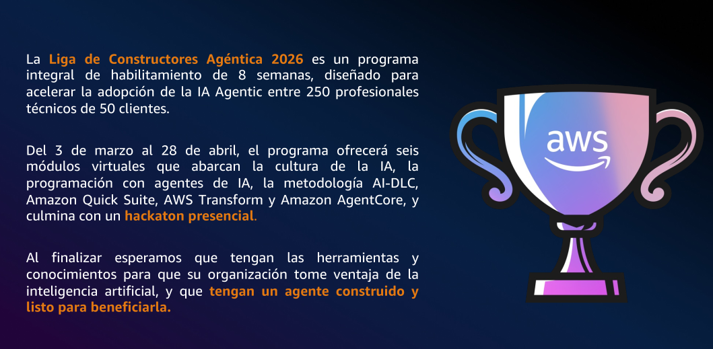
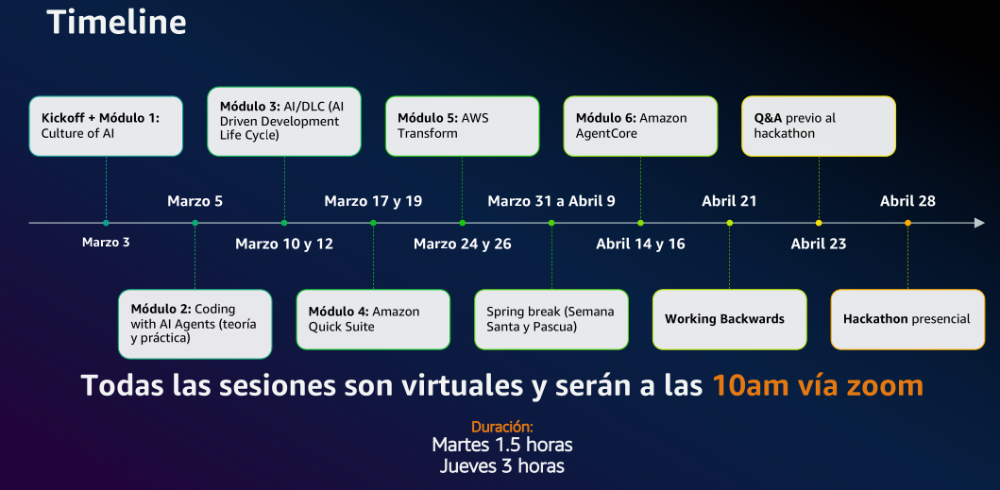

AWS's Agentic Builders League 2026
==================================

## Presentación

## Timeline

# Kiro, o un IDE agéntico

> 
> Es un Entorno de Desarrollo Integrado (IDE) von capacidades de IA Agéntica
> orientado al desarrollo de software desde dos metodologías:
>
> - Vibe Coding
> - Spec Coding

## Vibe Coding

Vibe Coding es ideal para desarrollos simples (mínimas transformaciones), pues se basa en el producto final
sin importar demasiado el camino intermedio.

## Spec Coding

Spec Coding es una metodología que permite desarrollar aplicaciones más complejas y mantener auditado el proceso de
decisión del agente.

En primer paso, el agente produce un archivo de requerimientos en lenguaje de negocio. 
En éste se subdividen las funcionalidades complejas en funcionalidades modulares, y se puede
influir en el proceso agéntico a través de agregar requerimientos específicos (el uso de un framework, 
una versión específica de software o un stack cloud particular).

En segundo paso, se genera, desde el archivo de requerimientos, un archivo de diseño, en el que ya se 
detalla cómo se solucionará cada una de las funcionalidades del sistema. 
Aquí ya se detallan modelos de datos, algoritmos de solución y especificaciones técnicas puntuales.

En tercer paso, se genera un archivo de Tareas. Este es un listado de acciones a efectuar
para que el diseño definido vea la luz. Aquí se pueden incluir operaciones opcionales
y obligatorias, además de tareas de testing unitario o de generación de datos de prueba.

Finalmente, se puede pedir al Agente que implemente todas las tareas, sólo las obligatorias, o alguna en particular.

## Kiro como asistente de desarrollo

Aparte de las dos metodologías para desarrollo, se puede usar al agente Kiro como asistente de desarrollo.
Es decir, solicitar cambios específicos sobre el código base del proyecto, se puede asistir para el depurado 
de codigo en local o incluso describir el funcionamiento en producción, y que ofrezca posibles
causantes del problema en base al código en local.

# AI/DLC : Cíclo de desarrollo impulsado por IA

Si Kiro y el Spec Driven apuntan a desarrollar aplicaciones puntuales, AI/DLC (AI Driven Development Life Cycle)
apunta a representar no sólo el desarrollo de una aplicación, sino todo el ciclo de vida del proyecto.

Pre requisitos, desarrollo, depuración, Despliegue contínuo, iteración...

## Puntos clave:

 - En base a documentos `.md` se describen las características que guían el desarrollo
 - Se utilizan `Steering Files` que describen decisiones de desarrollo para homogeneizar las decisiones del proyecto.
 - Modelo Asistido o Guiado

> NOTA: Si en el proceso de preguntas del agente, se responde a las preguntas en lugar de elegir las opciones dadas, el agente
> realizará un desarrollo más específico. Por ejemplo, qué algoritmo de solución utilizar, qué librería, etc.
>
> Es decir, que se puede tener el control tan granular y específico como se requiera.

# Amazon Bedrock AgentCore

Plataforma para crear, implementar, y operar agentes sin operar infraestructura.

## 9 primitivas de IA

### Primitivas de creación

 - Gateway
 - Memory
 - Browser (Built-in tool)
 - Code Interpreter (Built-in tool)

### Primitivas de Implementación

 - Runtime
 - Identity
 - Policy

### Primitivas de supervisión

 - Observability
 - Evaluations
 - AWS Agent Registry