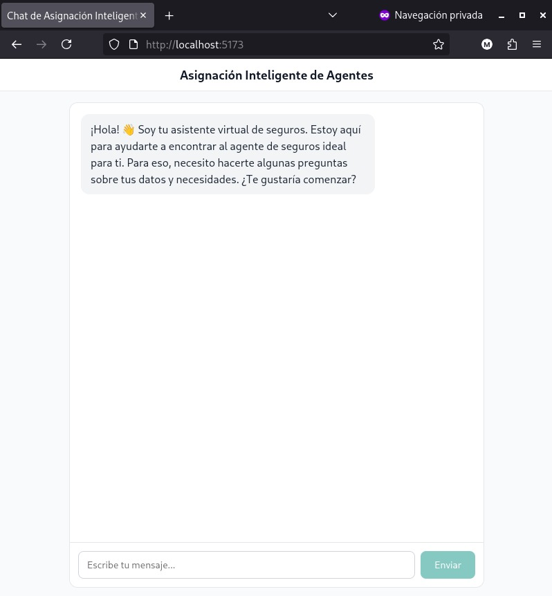

El hackathon de AWS Builders league Agentica
======================

# Qué hay aquí?
Este repositorio contiene el código generado durante el Hackathon de la 
Agentic Builders League de AWS del 28 de Abril de 2026.

# Documentos en este repo

- [Readme sobre Builders League](./00-doc/readme.md)
- Resultado del análisis Working Backwards:
  - [WB-AsignacionAgente.pdf](./00-WB/WB-AsignacionAgente.pdf)
  - [Mock WorkingBackwards](./00-WB/WB-AsignacionAgente-PartyRock-mockup/readme.md)

# Apps demo

## Versión 1.0.0

La versión 1 es una aplicación de Chat de Asignación Inteligente de Agentes. 
Se compone de un frontend tipo chat y un backend que responde a las peticiones.

Además, simula datos de Agentes de forma aleatoria desde un pool de fuentes.

### Stack Tecnológico

- **Frontend**: React + TypeScript con Vite
- **Backend**: Node.js + Express + TypeScript
- **Base de Datos**: SQLite (vía better-sqlite3) para simplicidad y portabilidad
- **Seed Script**: TypeScript ejecutable con ts-node
- **Testing**: Vitest + fast-check (property-based testing)

## Version 2.0.1

La versión 2 agrega un port del "server" de tecnología Node a PHP 8.4

### Stack Tecnológico

- **Frontend**: React + TypeScript con Vite (el mismo)
- **Backend**: PHP 8.4/Nginx 1.22.1
- **Base de Datos**: MariaDB 10.11
- **Seed Script**: PHP 8.4


# Working Backwards

Es una metodología de AWS que sirve para identificar y delinear un proyecto 
desde la necesidad a cubrir hasta las ideas de cómo implementar una solución.

## Herramienta Party Rock

_Party Rock_ es una herramienta que con IA generativa acompaña el proceso de
lluvia de ideas de un Working Backwards tal que permite simplificar el proceso 
de obtener las ídeas principales del proyecto y un "comunicado de prensa" que
describe la funcionalidad finalizada. 

Sin aspectos técnicos más allá de los vitales.

> - Herramienta PartyRock con el Working Backwards [ITP-LATAM-WB-Workshop - límpio](https://partyrock.aws/u/dxduarte/ILIvEOSua/ITP-LATAM-WB-Workshop)
>
> - Resultado del análisis Working Backwards: [WB-AsignacionAgente.pdf](./00-WB/WB-AsignacionAgente.pdf)
>
> - [Snapshot WB (requiere sesión Gmail Ds)](https://partyrock.aws/u/dxduarte/ILIvEOSua/ITP-LATAM-WB-Workshop/snapshot/s3asxdPKz) 

# Ejecución del demo

## Versión Node local

Ejecutar en el root del proyecto:

```bash
# cd ../hackathon26/ # Root dir
npm run dev
```
Luego, abrir [http://localhost:5173/](http://localhost:5173/)


## Versión PHP en servidor

Ir a [https://smnyl-dso-abl26.dspbit.com/](https://smnyl-dso-abl26.dspbit.com/)

## Vista del chat



